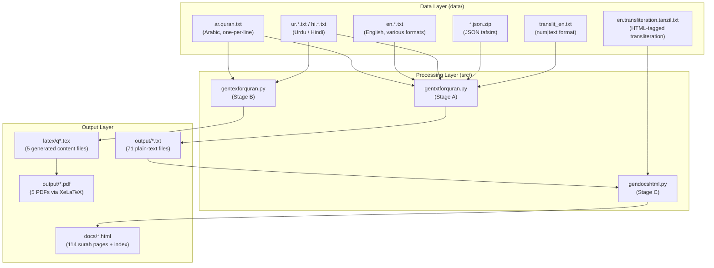

# Architecture

<!-- TOC -->
- [1. Overview](#1-overview)
- [2. Repository Layout](#2-repository-layout)
- [3. System Diagram](#3-system-diagram)
- [4. Data Layer](#4-data-layer)
  - [4.1 Input Data Formats](#41-input-data-formats)
  - [4.2 Canonical Quran Metadata](#42-canonical-quran-metadata)
- [5. Processing Layer](#5-processing-layer)
  - [5.1 gentxtforquran.py](#51-gentxtforquranpy)
  - [5.2 gentexforquran.py](#52-gentexforquranpy)
  - [5.3 gendocshtml.py](#53-gendocshtmlpy)
- [6. Output Layer](#6-output-layer)
  - [6.1 Plain-Text Files](#61-plain-text-files)
  - [6.2 LaTeX / PDF Files](#62-latex--pdf-files)
  - [6.3 Static HTML Website](#63-static-html-website)
- [7. Build System](#7-build-system)
- [8. Audio Architecture](#8-audio-architecture)
- [9. Design Decisions](#9-design-decisions)
<!-- /TOC -->

---

## 1. Overview

This repository is a **data-processing pipeline** that transforms raw Qur'an translation text files into three distinct output artefacts:

| Output | Format | Tool |
|--------|--------|------|
| Formatted plain-text editions | `.txt` (one file per translation) | `src/gentxtforquran.py` |
| Typeset bilingual PDFs | XeLaTeX → `.pdf` | `src/gentexforquran.py` + `xelatex` |
| Static HTML website | GitHub Pages (`docs/`) | `src/gendocshtml.py` |

There is no runtime server, no database, and no dynamic back-end. Everything is generated ahead of time from static source files.

---

## 2. Repository Layout

```
Quran-data/
├── src/                         # Python generator scripts (all run from root)
│   ├── gentxtforquran.py        # Stage A: data/ → output/*.txt
│   ├── gentexforquran.py        # Stage B: data/ → latex/q*.tex
│   └── gendocshtml.py           # Stage C: output/ + data/ → docs/*.html
│
├── data/                        # INPUT — source translation data (read-only)
│   ├── ar.quran.txt             # Arabic Uthmani script (6 236 lines)
│   ├── en.*.txt                 # English translations (various formats)
│   ├── ur.*.txt                 # Urdu translations
│   ├── hi.*.txt                 # Hindi translations
│   ├── gu.roman.rabila.txt      # Gujarati (Roman) translation
│   ├── *.json.zip               # JSON-in-ZIP explanations and tafsirs
│   ├── surna.txt                # Surah names (Arabic)
│   ├── suranamemal.txt          # Surah names (Malayalam / extended)
│   └── translit_en.txt          # Quran Unicode Project transliteration
│
├── latex/                       # LaTeX templates + generated content files
│   ├── quran.sty                # XeLaTeX style package (Arabic font, quran package)
│   ├── farooq.tex               # Template: Hindi (Farooq Khan) bilingual PDF
│   ├── suhail.tex               # Template: Hindi (Suhail) bilingual PDF
│   ├── sahih.tex                # Template: English (Saheeh International) bilingual PDF
│   ├── translit.tex             # Template: English Transliteration bilingual PDF
│   ├── pickthall.tex            # Template: English (Pickthall) bilingual PDF
│   ├── qum.tex                  # GENERATED — content for farooq.pdf
│   ├── qup.tex                  # GENERATED — content for suhail.pdf
│   ├── qus.tex                  # GENERATED — content for sahih.pdf
│   ├── qut.tex                  # GENERATED — content for translit.pdf
│   └── qupk.tex                 # GENERATED — content for pickthall.pdf
│
├── output/                      # BUILD OUTPUT — generated files
│   ├── quran_arabic.txt         # Formatted Arabic plain text
│   ├── quran_english_*.txt      # Formatted English plain-text translations
│   ├── quran_urdu_*.txt         # Formatted Urdu plain-text translations
│   ├── quran_hindi_*.txt        # Formatted Hindi plain-text translations
│   ├── quran_roman_*.txt        # Romanized transliteration outputs
│   ├── quran_gujarati_*.txt     # Gujarati output
│   ├── quran_nepali_*.txt       # Nepali output
│   ├── quran_translit_*.txt     # Transliteration outputs
│   ├── farooq.pdf               # Compiled bilingual PDF (Hindi / Arabic)
│   └── suhail.pdf               # Compiled bilingual PDF (Hindi / Arabic)
│
├── docs/                        # GitHub Pages website (all auto-generated)
│   ├── index.html               # Homepage / surah grid
│   ├── search.html              # Full-text search page
│   ├── download.html            # Download links page
│   ├── config.html              # User settings / preferences
│   ├── license.html             # License information page
│   ├── search-data.js           # Pre-built search index (JSON)
│   ├── config.js                # Persistent user preferences (JS)
│   └── 001.html … 114.html      # Individual surah pages
│
├── archive/                     # Legacy reference files (not used by build)
│   ├── Readme.txt               # Original project notes
│   └── makefile                 # Original legacy makefile
│
├── Makefile                     # GNU Make build orchestration
├── README.md                    # Project overview and usage guide
├── CONTRIBUTING.md              # Contributor guidelines
├── CHANGELOG.md                 # Version history
└── LICENSE                      # Unconditional Liberty Instrument (ULI) v1.0
```

---

## 3. System Diagram



**Pipeline execution order:**
1. `make generate-tex` → runs `gentexforquran.py` (data/ → latex/q*.tex)
2. `make all` → runs `xelatex` on each template (latex/ → output/*.pdf)
3. `make generate-txt` → runs `gentxtforquran.py` (data/ → output/*.txt)
4. `make generate-docs` → runs `gendocshtml.py` (output/ + data/ → docs/)

Steps 1–2 are independent of steps 3–4. Steps 3 and 4 must run in sequence (4 depends on 3).

---

## 4. Data Layer

### 4.1 Input Data Formats

All input files live in `data/`. There are four distinct formats:

#### Format 1: One Line Per Ayah (Sequential)
Files: `ar.quran.txt`, `en.sahih.txt`, `en.pickthall.txt`, `en.transliteration.txt`, `en.rwwad.txt`, `en.asad.txt`, `en.usmani.txt`, `en.abdelhaleem.txt`, `hi.farooq.txt`, `hi.hindi.txt`, `hi.omari.txt`, `ur.mahmudalhasan.txt`, `ur.zilalquran.txt`, `ur.bayanulquran.txt`, `ur.wahiduddin.txt`, `ur.romanmaududi.txt`, `ur.romanjunagarhi.txt`, `ur.karamshah.txt`, `ur.taqiusmani.txt`, `en.aishabewley.txt`, `en.aliunal.txt`, `en.lalehbakhtiar.txt`, `en.edwardpalmer.txt`, `en.farookmalik.txt`, `en.georgesale.txt`, `en.hamidsaziz.txt`, `en.johnrodwell.txt`, `en.literal.txt`, `en.miraneesuddin.txt`, `en.mohammadshafi.txt`, `en.muhammadghali.txt`, `en.khattab.txt`, `en.njdawood.txt`, `en.safikaskas.txt`, `en.shabbirahmed.txt`, `en.syedvickar.txt`, `en.itaninew.txt`, `en.tbirving.txt`, `en.monotheist.txt`, `en.ummmuhammad.txt`, `hi.roman.farooq.txt`, `hi.roman.suhail.txt`, `hi.roman.omari.txt`, `gu.roman.rabila.txt`

```
بِسْمِ ٱللَّهِ ٱلرَّحْمَٰنِ ٱلرَّحِيمِ
ٱلْحَمْدُ لِلَّهِ رَبِّ ٱلْعَٰلَمِينَ
...
```

- **Line count**: exactly 6,236 (the total number of ayahs in the Qur'an)
- **Encoding**: UTF-8
- **Iteration**: processed by reading one line per ayah in nested surah/ayah loops

#### Format 2: Pipe-Delimited `sura|ayah|text`
Files: `en.yusufali.txt`, `en.qarai.txt`, `en.hilali.txt`, `en.ahmedali.txt`, `en.ahmedraza.txt`, `en.arberry.txt`, `en.daryabadi.txt`, `en.itani.txt`, `en.maududi.txt`, `en.mubarakpuri.txt`, `en.qaribullah.txt`, `en.sarwar.txt`, `en.shakir.txt`, `en.wahiduddin.txt`, `ur.jalandhry.txt`, `ur.ahmedali.txt`, `ur.jawadi.txt`, `ur.kanzuliman.txt`, `ur.maududi.txt`, `ur.qadri.txt`, `ur.junagarhi.txt`, `ur.najafi.txt`, `en.pickthall.tanzil.txt`, `en.transliteration.tanzil.txt`

```
1|1|In the name of Allah, the Beneficent, the Merciful.
1|2|Praise be to Allah, Lord of the Worlds,
...
```

- Comment lines starting with `#` are skipped (in Yusuf Ali file)
- The script reads each line, splits on `|`, and takes the third field (index 2)

#### Format 3: Sequential `num|text`
File: `translit_en.txt`

```
1|Bismi Allahi alrrahmani alrraheemi
2|Alhamdu lillahi rabbi alAAalameena
...
```

- Global ayah number (1–6236) as the first field
- The script reads sequentially, splitting on `|` to extract text

#### Format 4: JSON-in-ZIP
Files: `hindi-mokhtasar.json.zip`, `abridged-explanation-of-the-quran.json.zip`, `rabila-al-umry-simple.json.zip`, `ahl-al-hadith-central-society-of-nepal-simple.json.zip`

Internal JSON structure:
```json
{
  "1:1": {"text": "بسم الله الرحمن الرحيم"},
  "1:2": {"text": "..."},
  ...
}
```

- **Keys**: `"sura:ayah"` strings (e.g., `"2:255"`)
- **Text field**: `"text"` for most files; `"t"` for `rabila-al-umry-simple.json.zip` and `ahl-al-hadith-central-society-of-nepal-simple.json.zip`
- Some entries may use string aliases rather than direct objects (handled by double-lookup)

### 4.2 Canonical Quran Metadata

Both `gentxtforquran.py` and `gentexforquran.py` embed the same two arrays:

**`surasize`** — 114-element list of ayah counts per surah:
```python
[7, 286, 200, 176, 120, 165, 206, 75, 129, 109, ...]
# Sum = 6,236
```

**`suraname`** — 114-element list of English surah names:
```python
["Al-Fatihah (The Opening)", "Al-Baqarah (The Cow)", ...]
```

`gendocshtml.py` uses `SURA_SIZE` and `SURA_NAME` (same data, uppercase naming), plus additional arrays:
- `SURAH_REV` — `(revelation_order, 'M'/'D')` per surah (Meccan vs. Medinan)
- Juz, manzil, rukū, and sajdah data for navigation metadata

---

## 5. Processing Layer

### 5.1 gentxtforquran.py

**Purpose**: Transform all source translation data into uniformly formatted plain-text files.

**Algorithm** (for each entry in the `translations` list):
1. Open output file for writing (UTF-8)
2. Write a language-specific header (title + translator line + `=` separator)
3. For each surah (0–113):
   a. Write `Surah N: <name>` heading
   b. Write `---` separator
   c. For each ayah (1–surasize[sura]):
      - Read one record from source (format-specific)
      - Write `[sura:ayah] text\n`
4. Write blank line between surahs

**Format dispatch table:**

| Lang type | Format | Reading strategy |
|-----------|--------|-----------------|
| `English`, `Arabic`, `Hindi`, `Urdu`, `Roman-*` | One-per-line | `readline()` |
| `English-SuraAyah`, `Urdu-SuraAyah`, `English-Piped` | Pipe-delimited | `split('|', 2)[2]` |
| `Transliteration-Sequential` | `num\|text` | `split('|', 1)[1]` |
| `Hindi-Tafsir-JSON`, `English-Tafsir-JSON` | JSON ZIP | `entry.get('text', '')` |
| `Gujarati-JSON`, `Nepali-JSON` | JSON ZIP | `entry.get('t', '')` |

**Complexity**: O(N) where N = 6,236 ayahs, for each of the 71 translations → O(71 × 6,236) ≈ O(443,000) total reads.

### 5.2 gentexforquran.py

**Purpose**: Generate LaTeX content files that interleave Arabic text (via the `quran` package) with translation text.

**For each of 5 PDF editions:**
1. Open the generated `.tex` content file for writing and the source translation file for reading
2. For each surah:
   a. Emit `\chapter{name}`
   b. Emit `\basmalah` in Arabic block
   c. For each ayah:
      - Emit `\quranayah[sura][ayah]` in an Arabic right-flush block
      - Read translation line from source
      - Emit translation in a left-flush block (Hindi in `{hindi}` environment; English as plain text)

**Output files:**

| Content file | Template | Translation |
|-------------|----------|-------------|
| `latex/qum.tex` | `farooq.tex` | Hindi — Muhammad Farooq Khan |
| `latex/qup.tex` | `suhail.tex` | Hindi — Suhel Farooq Khan |
| `latex/qus.tex` | `sahih.tex` | English — Saheeh International |
| `latex/qut.tex` | `translit.tex` | English Transliteration |
| `latex/qupk.tex` | `pickthall.tex` | English — Pickthall |

### 5.3 gendocshtml.py

**Purpose**: Generate the complete static HTML website in `docs/`.

**Key responsibilities:**
- Reads 16+ output text files (from `output/`) and two data files (from `data/`)
- Builds per-ayah data structures for each of the 114 surahs
- Writes `docs/NNN.html` for each surah (1-indexed, zero-padded to 3 digits)
- Writes `docs/index.html` (surah grid homepage)
- Writes `docs/search.html` (full-text search page)
- Writes `docs/search-data.js` (pre-built JSON search index)

**Data loaded into memory:**
- Arabic text (6,236 lines)
- Tanzil transliteration with HTML tags (pipe-delimited)
- Unicode transliteration (sequential num|text)
- Hindi translations (Farooq Khan, Suhail, Al-Omari)
- Hindi Tafsir (Al-Mokhtasar)
- English Explanation (Abridged)
- English translations (Pickthall, Yusuf Ali, Saheeh International, Hilali & Khan)
- Gujarati translation (Rabila Al-Umry)
- Nepali translation (Ahl-al-Hadith Nepal)
- Roman Urdu translations (Maududi, Junagarhi)

**Surah page structure** (`docs/NNN.html`):
- Header with surah name, revelation metadata (Meccan/Medinan, revelation order)
- Surah navigator dropdown
- Verse & Content Filter widget (collapsible, checkboxes per content type)
- Per-ayah HTML table rows, each containing:
  - Ayah number badge
  - Arabic text (right-to-left, Amiri Quran font)
  - Audio player (streaming from Hugging Face Space)
  - Tanzil transliteration (HTML tags preserved)
  - Unicode transliteration
  - Up to 14 translation rows (English, Hindi, Urdu, Gujarati, Nepali)
- Dark/light mode toggle
- Footer with attribution

---

## 6. Output Layer

### 6.1 Plain-Text Files

71 files in `output/`, each with:
- 2-line header (language-specific title + translator credit)
- `====` separator
- 114 surah sections, each with:
  - `Surah N: <name>` heading
  - `--------` separator
  - Lines in `[sura:ayah] text` format
  - Blank line separator

### 6.2 LaTeX / PDF Files

5 PDF editions using XeLaTeX with:
- `quran` package for Arabic text rendering (Hafs font)
- `polyglossia` package for multilingual support
- `fontspec` for custom Arabic and Hindi fonts
- Right-to-left Arabic with left-to-right translation interleaved

### 6.3 Static HTML Website

114 surah pages + 5 special pages (`index`, `search`, `download`, `config`, `license`).

Key features:
- **No JavaScript framework** — plain HTML/CSS/JS
- **Responsive design** — mobile breakpoints at 600px and 380px
- **Dark mode** — CSS `prefers-color-scheme` + JS toggle
- **Full-text search** — client-side using pre-built `search-data.js` index
- **Audio playback** — `<audio>` elements streaming from Hugging Face Space
- **Persistent settings** — `localStorage` via `config.js`

---

## 7. Build System

`Makefile` defines five targets:

```
generate-tex  →  python3 src/gentexforquran.py
all           →  xelatex for each .tex template
generate-txt  →  python3 src/gentxtforquran.py
generate-docs →  python3 src/gendocshtml.py
clean         →  rm latex/*.aux *.log *.toc *.out *.synctex.gz
```

Dependency graph:
```
generate-tex ──┐
               ├──► all (PDFs)
generate-txt ──┤
               └──► generate-docs (HTML)
```

---

## 8. Audio Architecture

Audio recitation (Mishary Rashid Alafasy, 128 kbps) is served from an external Hugging Face Space:

```
URL pattern: https://druvx13-quran-audio-alafasy.hf.space/<SSSAAA>.mp3
             where SSS = 3-digit surah number, AAA = 3-digit ayah number
Example:     https://druvx13-quran-audio-alafasy.hf.space/001001.mp3
```

The Hugging Face Space runs a Python `http.server` serving a directory of 6,236 MP3 files unzipped from `everyayah.com`. All audio URL construction happens inside `gendocshtml.py`.

To self-host audio, replace the base URL in `gendocshtml.py` (search for `hf.space`) and re-run the generator.

---

## 9. Design Decisions

| Decision | Rationale |
|----------|-----------|
| Static generation (no server) | Simplest possible hosting; GitHub Pages supports static files natively |
| Python scripts over shell scripts | Better Unicode handling, JSON support, and cross-platform compatibility |
| XeLaTeX for PDFs | Best support for Arabic (right-to-left), Hindi (Devanagari), and Unicode fonts |
| All data as plain text | Maximum portability; editable with any text editor; no database dependency |
| JSON-in-ZIP for large tafsirs | Keeps Git repository size manageable while preserving structured data |
| `docs/` as GitHub Pages root | Zero-configuration Pages deployment using the `docs/` folder convention |
| Pre-built search index (`search-data.js`) | Enables fast client-side full-text search without a server |
| `output/` not gitignored (text files) | Plain-text output files are small enough to track; enables direct download without rebuilding |
| Audio on Hugging Face (external) | MP3 files (~600 MB total) are too large for GitHub; external hosting keeps the repo lean |
